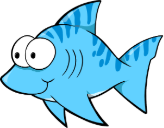

#  Noah Cohen Kalafut, PhD

Hello! Thank you for taking a look at my profile. I'm a machine learning researcher based in the United States 🇺🇸.

I've been passionate about programming and mathematics for as long as I can remember. Being born in 2001, the concept of AI was drastically different than now. However, the idea of AI piqued my interest immediately and has since developed into a hobby and profession. After starting my undergraduate program in 2017, I began independent and sanctioned research projects into reinforcement learning, natural language processing, and computer vision. Later, throughout my PhD from 2020 to 2025, I continued to research machine learning with a particular focus on low-level understanding.

During the course of my education, I've held several roles that have given me opportunities to develop impactful methods and projects, including:

<table style="border: none; border-collapse: collapse;">
  <tr>
    <td style="border: none; padding: 0px;">
        
    </td>
    <td style="border: none; padding: 10px; vertical-align: top;">
        Managing the creation of an LLM application providing emotional support to mothers in the workforce, including implementation of traditional and reinforcement learning fine-tuning pipelines with an emphasis on user safety.
    </td>
  </tr>
  <tr>
    <td style="border: none; padding: 0px;">
        
    </td>
    <td style="border: none; padding: 10px; vertical-align: top;">
        Leading research teams in single-cell biology resulting in publications in reinforcement learning, variational methods, graph learning, and optimal transport in Q1 AI and biochemistry journals. Concurrently developing open-source libraries to encourage innovation.
    </td>
  </tr>
  <tr>
    <td style="border: none; padding: 0px;">
        
    </td>
    <td style="border: none; padding: 10px; vertical-align: top;">
        Developing interactive client-facing dashboards to visualize factors driving KPI. Concurrently performing research into data anonymization and conducting briefings on nascent ML technologies, including generative modeling.
    </td>
  </tr>
  <tr>
    <td style="border: none; padding: 0px;">
        
    </td>
    <td style="border: none; padding: 10px; vertical-align: top;">
        Designing and maintaining the talent-employer matching algorithm (2018-2022) for 500K+ users, as well as client contract prioritization and outcome prediction. Concurrently maintained cross-team and backend databases.
    </td>
  </tr>
</table>

<!-- &nbsp;
Managing the creation of an LLM application providing emotional support to mothers in the workforce, including implementation of traditional and reinforcement learning fine-tuning pipelines with an emphasis on user safety. -->

<!-- &nbsp;
Leading research teams in single-cell biology resulting in publications in reinforcement learning, variational methods, graph learning, and optimal transport in Q1 AI and biochemistry journals. Concurrently developing open-source libraries to encourage innovation. -->

<!-- &nbsp;
Developing interactive client-facing dashboards to visualize factors driving KPI. Concurrently performing research into data anonymization and conducting briefings on nascent ML technologies, including generative modeling. -->

<!-- &nbsp;
Designing and maintaining the talent-employer matching algorithm (2018-2022) for 500K+ users, as well as client contract prioritization and outcome prediction. Concurrently maintained cross-team and backend databases. -->

If you're interested in any of my libraries or would like to work together, please don't hesitate to [send me an email](mailto:contact@noahcohenkalafut.com) or [check out my publications](https://orcid.org/0000-0003-1421-0829).

---

## Main Languages, Libraries, and Tools

&nbsp;
&nbsp;
&nbsp;
&nbsp;
&nbsp;
&nbsp;
&nbsp;
&nbsp;
&nbsp;
&nbsp;
&nbsp;
&nbsp;
&nbsp;

---

## Featured Publications and Preprints

[Inferring virtual cell environments using multi-agent reinforcement learning](https://doi.org/10.1101/2025.11.21.689815)

<!-- [Cooperative multi-view integration with a scalable and interpretable model explainer](https://doi.org/10.1038/s42256-025-01111-w) -->

[Network-based drug repurposing for psychiatric disorders using single-cell genomics](https://doi.org/10.1016/j.xgen.2025.101003)

[Personalized Single-cell Transcriptomics Reveals Molecular Diversity in Alzheimer’s Disease](https://doi.org/10.1101/2024.11.01.24316589)

<!-- [NeuroTD infers time varying delays in neural activities by adaptive sliding window alignment](https://doi.org/10.1101/2024.10.28.620662) -->

<!-- [MANGEM: A web app for multimodal analysis of neuronal gene expression, electrophysiology, and morphology](https://doi.org/10.1016/j.patter.2023.100847) -->

[Joint variational autoencoders for multimodal imputation and embedding](https://doi.org/10.1038/s42256-023-00663-z)
[BOMA, a machine-learning framework for comparative gene expression analysis across brains and organoids](https://doi.org/10.1016/j.crmeth.2023.100409)

---

*Last updated: February 16, 2026*